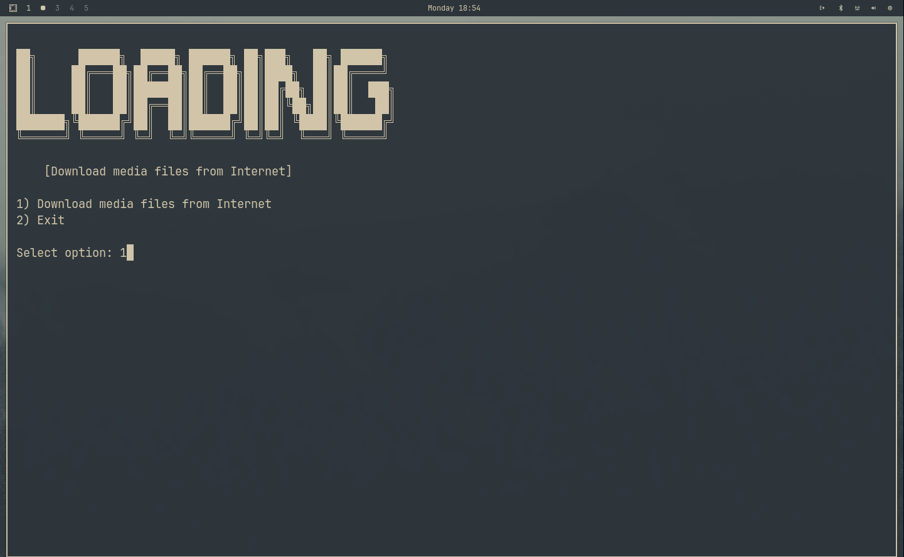
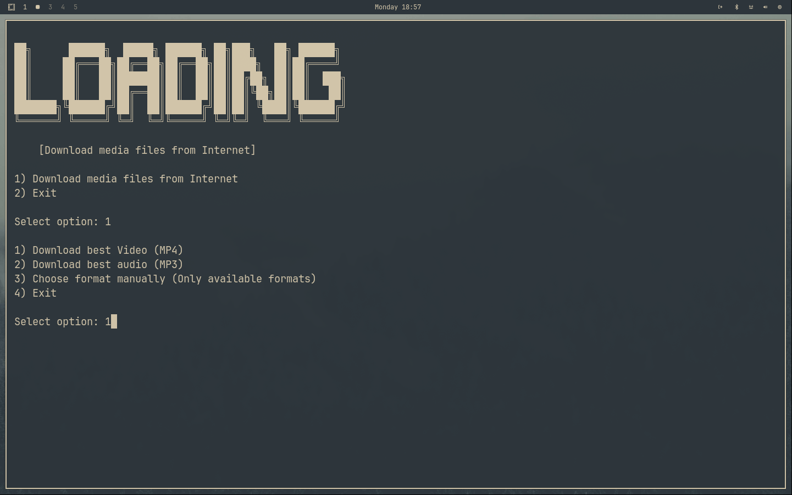

<div align="center">


<p>[ Download video & audio files from Internet ]</p>

---
</div>

## Prerequisites
- [**bash**](https://www.gnu.org/software/bash/) 
- [**git**]()
- [**yt-dlp**](https://github.com/yt-dlp/yt-dlp)
- [**ffmpeg**](https://ffmpeg.org/)

## Installation
### For Linux Users
```bash
git clone https://github.com/majumdersayak/loading.git
cd loading
chmod +x install.sh
./install.sh
```
### For Windows Users

#### 1st install git from <a href="https://git-scm.com/ target=_blank">https://git-scm.com/</a>

<p>[Git is recommended as when we'll update ! you can just simply update it via git pull]</p>

#### Then open Windows Poweshell & run this commands one by one 👇

```bash
git clone https://github.com/majumdersayak/loading.git
```
```bash
cd loading
```
```bash
Set-ExecutionPolicy RemoteSigned -Scope CurrentUser
```
```bash
.\install.ps1
```
## Usage

Just type
```bash
loading
```
## Some Glimpses

<b>On Linux </b>
<div align="center">



</div>
<b>On Windows</b>
<div align="center">



</div>

## Contribution

Contributions of any kind to improve this project are always welcome!
