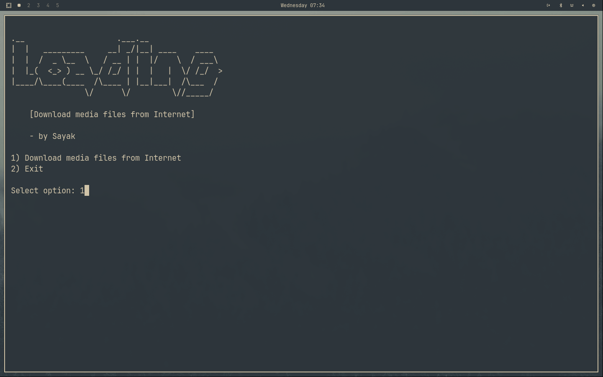

<div align="center">


<p>[ Download video & audio files from Internet ]</p>

---
</div>

## Prerequisites
- [**bash**](https://www.gnu.org/software/bash/) 
- [**yt-dlp**](https://github.com/yt-dlp/yt-dlp)
- [**ffmpeg**](https://ffmpeg.org/)

## Installation
```bash
git clone https://github.com/majumdersayak/loading.git
```
```bash
cd loading
```
```bash
chmod +x install.sh
```
```bash
./install.sh
```
## Usage

Just type
```bash
loading
```
<div align="center">



</div>

## Contribution

Contributions of any kind to improve this project are always welcome!
